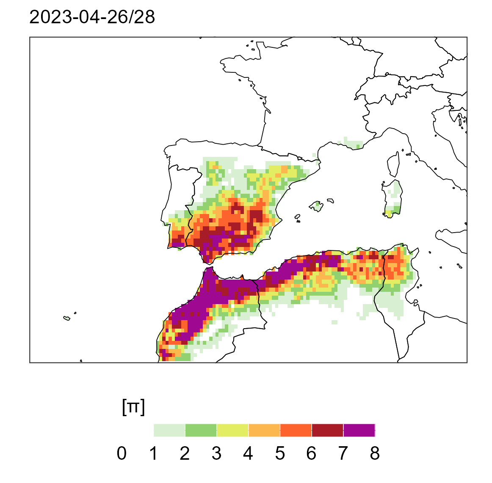

# Coupling [](https://zenodo.org/doi/10.5281/zenodo.11047471)


`Coupling` computes daily (π) and long-term (Π) soil moisture-temperature coupling metrics firstly introduced in [*Miralles et al. (2012)*](https://agupubs.onlinelibrary.wiley.com/doi/full/10.1029/2012GL053703)

## Installation

Installing and loading the `coupling` package
```r
# remotes::install_github("lemuscanovas/coupling")
library(coupling)
```
Other required libraries to run the examples below:

```r
library(tidyverse)
library(terra)
library(tidyterra)
```
    

## Day-by-day soil moisture-temperature coupling by means of **π** metric


Reading all variables needed for computing π
```r
# loading needed variables for computing lower pi

# Actual/total evaporation (cummulated value until 00h)
e <-system.file("extdata", "e_04_00h_2010_2023.nc", package = "coupling") %>% rast()
e <- e * 1000 # to mm
e <- -e # reverting the ECMWF convention for vertical fluxes which is positive downwards 

# Potential evaporation (as above)
pev <- system.file("extdata", "pev_04_00h_2010_2023.nc", package = "coupling") %>% rast()
pev <- pev * 1000
pev <- -pev


# Surface Solar net radiation and surface thermal radiation
ssr <- system.file("extdata", "ssr_04_00h_2010_2023.nc", package = "coupling") %>% rast()
ssr <- -ssr
str <- system.file("extdata", "str_04_00h_2010_2023.nc", package = "coupling") %>% rast()
str <- -str

# daily mean temperature at 2m
tasmean <- system.file("extdata", "tasmean_04_2010_2023.nc", package = "coupling") %>% rast()
tasmean <- tasmean - 273.15
```

Computing the latent heat of vaporisation following Priestley & Taylor (1972)

```r
l <- latent_heat_vapor(tas = tasmean)
```

Computing the energy balances for actual and potential evaporation to estimate
actual and potential sensible heat fluxes.

```r
# First we sum both radiation components
sr <- ssr+str
H <- energy_balance(Rn = sr,l = l,E = e)

Hp <- energy_balance(Rn = sr,l = l,E =  pev)
```

Calculating lower pi (π)
```r
pi <- lower_pi(tas = tasmean, H = H, Hp = Hp)
```
π metric visualization for the 26-28 April 2023. More datails about this event can be found in [*Lemus-Canovas et al. (2024)*](https://www.nature.com/articles/s41612-024-00569-6)

```r
world <- giscoR::gisco_get_countries()

col_temp <- c("white","white","#7DC971","#E1F166","#FDB34E","#FA4B26","#830024","purple")

# Extracting  π values for 26-28 april 2023 HW.  
event <- pi[[416:418]] %>% app("mean") %>%
  setNames(c("2023-04-26/28"))

ggplot() +
  geom_spatraster(data = event) +
  geom_spatvector(data = world, fill = NA, size = 0.4, color = "black")+
  scale_fill_stepsn(colours = col_temp, 
                       limits = c(0,8),
                       breaks = seq(0,12,1),
                       guide = guide_colorbar(barheight = 0.5,
                                              barwidth = 10,
                                              title.position = "top"),
                       name = "[π]",
                       na.value = "white")+
  scale_x_continuous(expand = c(0,0),limits = c(-20,15))+
  scale_y_continuous(expand = c(0,0), limits = c(30,50))+
  labs(subtitle = names(event))+
  theme_bw()+
  theme(axis.title = element_blank(),
        axis.text = element_blank(),
        axis.ticks = element_blank(),
        panel.grid = element_blank(),
        strip.background = element_blank(),
        legend.position = "bottom",
        strip.text  = element_text(face = "plain", size = 11),
        legend.text = element_text(size = 11),
        legend.title = element_text(size = 11))
```


## Long-term coupling example (**Π**) - to-do

## Package Citation
Marc Lemus-Canovas. (2024). coupling (0.1.0). Zenodo. https://doi.org/10.5281/zenodo.11047472

## Contact
Marc Lemus-Canovas (marc.lemusicanovas@eurac.edu)

## Additional references

- Miralles, D. G., M. J. vanden Berg, A. J. Teuling, and R. A. M. deJeu. Soil moisture-temperature coupling: A multiscale observational analysis, Geophys. Res. Lett., 39, L21707,(2012). doi:10.1029/2012GL053703. 
- Lemus-Canovas, M., Insua-Costa, D., Trigo, R.M. et al. Record-shattering 2023 Spring heatwave in western Mediterranean amplified by long-term drought. npj Clim Atmos Sci 7, 25 (2024). https://doi.org/10.1038/s41612-024-00569-6


